# Talking Lamp 설계 사양서

**팀 PIXS** | v0.8 (2026-09-07) | 개발 진행 중 · 일부 항목은 실측 후 확정

> 표기: **[확정]** 변경 시 다른 항목에 연쇄 영향 / **[임시]** 실측 후 확정 / **[미정]** 후보 중 택일 필요

**변경 이력** (기능·사양 변경만 기록함)

- 시나리오를 6개에서 4개로 축소 (구 S3 자연어 조명 제어, 구 S5 상황 인식 자연 발화 제외)
- IK 실행 보드를 Pi로 확정
- 보드 구성을 Raspberry Pi 5 + Jetson 2보드로 확정
- 공통 규약(좌표계·관절 순서) 신설
- VLM·TTS 모델 확정, 메모리 예산을 실측값으로 교체
- 웨이크워드를 `pvporcupine`에서 openWakeWord 자체 학습으로 교체
- 서보 12V·마이크 XVF3800 확정

---

## 1. 주제 소개

- 책상 위에 놓는 관절형 AI 로봇 스탠드임
- 카메라와 마이크로 주변 상황을 인식하고, 스스로 판단해 고개를 돌리거나 조명 위치·밝기를 조절하고 음성으로 대화함

핵심 동작은 세 가지임.

- **조명 자동 배치** : 사용자가 책상 위에 책이나 키보드를 놓으면 그 위치를 인식해 조명 각도를 맞춤. 눈부심과 손 그림자를 피하는 방향으로 접근함
- **음성 대화** : 호명하면 고개를 돌려 사용자를 보고 한국어로 대화함
- **표정·반응 모션** : 대화 중에도 대기 중에도 고개 끄덕임과 미세 시선 이동으로 살아있는 느낌을 줌

인터넷 연결이나 외부 서버 없이 독립적으로 동작함. 처리 구조는 2절 참고.

---

## 2. 아키텍처

### 2.1 아키텍처 도식화

시스템은 응답 속도가 다른 4개 레이어로 나뉨.

- 대화 판단은 초당 1회 이하로만 가능함
- 반면 살아있다는 느낌은 100ms 안에 반응해야 나옴
- 그래서 빠른 반응과 느린 판단을 분리함

| 레이어 | 역할 | 주기 | 모델 사용 | 실행 보드 |
| --- | --- | --- | --- | --- |
| **L3 기능** | 조명 자동 배치 (검출 + 기하 계산) | 이벤트 발생 시 | 검출기만 | Jetson + Pi |
| **L2 인지** | 상황 인식과 대화 (통합 VLM) | 0.3~0.5 Hz | 사용 | Jetson |
| **L1 반사** | 얼굴·소리 방향 추종 (칼만 필터) | 50 Hz | 미사용 | Pi |
| **L0 대기 모션** | 호흡·미세 시선 등 기본 모션 | 항상 | 미사용 | Pi |

네 레이어의 출력은 모션 블렌더에서 우선순위에 따라 합성되고, 100 Hz 궤적 생성기를 거쳐 서보모터로 나감.

**보드 구성 [확정]**

Raspberry Pi 5와 Jetson Orin Nano 8GB를 기가비트 Ethernet으로 직결해 함께 씀. VLM이 한 번에 2~3초씩 보드를 점유하면 100 Hz 모터 명령이 밀려 움직임이 덜컥거리므로, 계산하는 보드와 모터를 돌리는 보드를 물리적으로 나눔.

| 보드 | 담당 |
| --- | --- |
| **Jetson Orin Nano 8GB** | VLM, STT, TTS, 검출기, 3D 타겟점 계산 |
| **Raspberry Pi 5** | 서보 버스, 100 Hz 궤적 생성기, 모션 블렌더, 역기구학(IK), L0/L1, LED |

- 카메라·마이크·스피커 신호는 한쪽 보드로 모으고, 베이스와 상판 사이는 Ethernet 1가닥으로 이음
- Jetson은 3D 타겟점(얼굴·물체 위치, 조명 목표점)까지만 내고, IK는 Pi의 제어 루프 안에서 풂. 보드 경계를 넘어가는 것은 3D 좌표와 프리미티브 이름뿐이며 관절 각도는 넘어가지 않음 (2.3절)
- **[미정]** 아래 세 가지는 B(김태현)가 런타임을 설계하면서 확정함
  - 이벤트 버스의 구체적 방식 (Ethernet 소켓 기반 제안)
  - 전역 상태머신을 어느 보드에서 돌릴지
  - 마이크와 웨이크워드를 어느 보드에 붙일지. 마이크가 붙는 보드에서 웨이크워드도 함께 도는 것이 자연스러움

### 2.2 아키텍처 파트별 구성

- 개발은 5개 파트로 나누고 1인 1파트로 담당함
- 기구·서보 저수준 기반은 LeLamp 오픈소스에서 재사용함 (부록 A 참조)
- 그 위에서 동작하는 온보드 AI·비전·모션 지능은 전부 새로 만듦

| 파트 | 담당자 | 비중 |
| --- | --- | --- |
| **A. 인지** | 주경태 | 15% |
| **B. 시스템통합** | 김태현 | 21% |
| **C. 음성** | 최승원 | 18% |
| **D. 비전** | 김아현 | 16% |
| **E. 움직임 + 하드웨어 + IK엔진** | 이수혁 | 30% |

**A. 인지 (주경태)**

- VLM으로 상황을 판단함
- 대사와 행동 태그를 만듦

**B. 시스템통합 (김태현)**

- 전체 상태(대기 / 청취 / 사고 / 발화)를 관리함
- 여러 시나리오가 겹칠 때 우선순위를 정리함
- 메모리 등 자원을 배분하고 동작을 기록함

**C. 음성 (최승원)**

- 마이크로 듣고 텍스트로 바꿈
- 대답을 음성으로 합성해 말함
- 스피커 소리가 마이크로 되돌아오는 것을 지움
- 소리가 난 방향을 추정함

**D. 비전 (김아현)**

- 카메라로 물체·얼굴 위치를 찾아 3D로 환산함
- 조명이 향할 목표 지점과 밝기·각도를 계산함
- 하드웨어 물품 발주를 담당함

**E. 움직임 + 하드웨어 + IK엔진 (이수혁)**

- 관절 각도를 계산함 (역기구학)
- 부드러운 움직임을 만듦 (칼만 필터, 모션 블렌더, 궤적 생성기)
- 서보모터를 구동함
- 전원·기구·조명 등 하드웨어 전체를 구성·조립함

**논의 필요 사항 (아직 미반영)**

- 시나리오 성공 기준을 정성적 서술 대신 P95 등 정량 수치로 바꾸는 안
- 전역 상태머신을 더 세분화하는 안
- 헤드 무게·토크를 계산식으로 미리 검증하는 안 (250g가 이미 위험 구간일 수 있음)

### 2.3 전체 파이프라인 · 데이터 흐름



<!-- 다이어그램 소스: docs/images/pipeline.mmd (Mermaid). 수정할 때는 .mmd를 고치고 SVG를 다시 내보낼 것 -->

- 보드 경계를 넘어가는 것은 **3D 좌표와 프리미티브 이름뿐**이며, 관절 각도는 넘어가지 않음
- IK는 L1(추종)과 L3(조명 자세) 양쪽에서 쓰이고 둘 다 Pi의 제어 루프 안에 있음
- 대사와 음성 합성은 Jetson 안에서 끝나므로 Pi로 넘어오지 않음

**설계 원칙**

- 레이어 간 주고받는 값은 절대 관절 각도로 통일함. 속도나 상대 변위를 섞으면 블렌딩 단계가 지저분해짐
- VLM은 무엇을 할지만 결정하고, 어떻게 움직일지는 미리 만들어둔 모션(프리미티브)이 재생함. 그래야 모션 품질을 코드가 아니라 파라미터 조정만으로 다듬을 수 있음
- 카메라 처리, 음성 처리, 모션 루프는 서로 다른 스레드로 분리함. 하나가 다른 하나를 막으면 서보가 떨림

**메모리 배분** (Jetson 8GB 기준, 단위 GB)

- Jetson의 8GB는 CPU와 GPU가 함께 씀
- 따라서 모델 파일 크기의 합이 아니라 프로세스가 실제로 점유하는 피크 메모리(RSS)로 예산을 잡음
- 가중치 외에 아래가 전부 여기에 포함됨
  - KV 캐시, 비전 인코더, CUDA 작업공간, 카메라 버퍼, Python 런타임

| 항목 | 예산 | 근거 |
| --- | --- | --- |
| OS + 기본 환경 | 1.4~1.9 | 헤드리스 운영(데스크톱 GUI 비활성) 전제 |
| 통합 VLM (L2), InternVL3_5-2B-HF | 3.22 | 실측 (A/주경태). Jetson Orin Nano 8GB 온보드, INT4 양자화, 이미지 8장 × 한국어 질문 3개. `/proc/meminfo` 로딩 전후 순증가분 |
| 음성 STT + TTS | 1.8 | 실측 (C/최승원). Jetson 온보드, MeloTTS ONNX int8 + STT |
| 검출기 (L3) | 0.3~0.7 | **[임시]** 모델 선정 후 확정 (D/김아현) |
| 오케스트레이터·로그 | 0.2~0.4 | **[임시]** (B/김태현) |
| **합계** | **6.9 ~ 8.0** | |

**상한 게이트는 7.2 GB임.** 통합 상태에서 이 값을 넘거나 swap이 발생하면 구성을 다시 잡음. 낙관적으로 잡아도 6.9라 여유가 0.3뿐이고, 아직 안 잰 검출기와 오케스트레이터가 어디로 나오느냐가 통과 여부를 가름. 초과 시 VLM 입력 해상도·컨텍스트 축소 → TTS·검출기 경량화 → 모델 온디맨드 적재 순으로 대응하며, 이는 개별 파트가 아니라 팀 전체가 함께 관리할 예산임.

### 2.4 공통 규약 **[확정]**

기준이 서로 다르면 통합 시점에 전부 다시 짜야 하므로, 아래는 A(주경태)·B(김태현)·C(최승원)·D(김아현)·E(이수혁) 전원이 예외 없이 따름 (E(이수혁)의 모션 코드에 이미 이 기준으로 구현되어 있음).

**좌표계 `lamp_base`**

- 원점은 램프 베이스 바닥 중심
- +x는 앞쪽(사용자 방향), +y는 왼쪽, +z는 위
- 단위는 미터
- 모든 3D 위치(얼굴, 물체, 조명 타겟, 소리 방향)를 이 프레임으로 통일함

**관절 각도**

- 배열 순서 고정 : `[base_yaw, base_pitch, elbow_pitch, wrist_roll, wrist_pitch]` (서보 ID 1~5 순서)
- 단위는 라디안
- 부호와 원점은 MuJoCo 모델 정의를 기준으로 함

**주고받는 값의 형식**

- 레이어 간 인터페이스는 절대 관절 각도로만 함. 속도나 상대 변위를 섞지 않음
- 모든 이벤트에 타임스탬프를 붙임 (단조 증가 시간, `time.monotonic()`)
- 검출 결과와 관절 상태의 시간 차가 허용치를 넘으면 기하 계산에 쓰지 않음

**파트별로 지켜야 할 것**

| 파트 | 지킬 것 |
| --- | --- |
| **A** 인지 (주경태) | 행동 태그가 관절 각도를 직접 만들지 않음 (프리미티브 이름만 냄) |
| **B** 시스템통합 (김태현) | 이 규약을 이벤트 스키마에 그대로 반영함 |
| **C** 음성 (최승원) | DOA(소리 방향)를 `lamp_base` 기준 방위·고도 또는 방향 벡터로 냄 |
| **D** 비전 (김아현) | 3D 타겟점과 얼굴 위치를 `lamp_base` 프레임으로 냄 |
| **E** 움직임 (이수혁) | 위 규약의 기준 구현을 소유하고, 변경 시 전 파트에 공지함 |

### 2.5 파트 간 인터페이스

각 파트가 무엇을 주고받는지 한 곳에 모음. 파트별 절에서 따로 적지 않고 이 표를 기준으로 함.

| 보내는 쪽 | 받는 쪽 | 무엇을 | 쓰이는 곳 |
| --- | --- | --- | --- |
| C 음성 (최승원) | B 통합 (김태현) | 음성 인식 텍스트 | 대화 시작 |
| B 통합 (김태현) | A 인지 (주경태) | 음성 인식 텍스트 | VLM 입력. 호출 시점은 B(김태현)가 정함 |
| A 인지 (주경태) | B 통합 (김태현) | 대사와 행동 태그 (JSON) | 라우팅 |
| B 통합 (김태현) | C 음성 (최승원) | 대사 | TTS 출력 |
| B 통합 (김태현) | E 움직임 (이수혁) | 행동 태그, 모션 인터럽트 | 프리미티브 재생, barge-in |
| D 비전 (김아현) | E 움직임 (이수혁) | 3D 타겟점과 조명 파라미터 | IK 입력 (S1) |
| D 비전 (김아현) | E 움직임 (이수혁) | 얼굴 검출 결과 | L1 칼만 입력 (S2) |
| C 음성 (최승원) | E 움직임 (이수혁) | 소리 방향(DOA)과 측정 오차 | L1 칼만 입력 (S6) |
| D 비전 (김아현) | B 통합 (김태현) | 상태 이벤트 (조명 배치 완료, 재실 변화) | 시나리오 중재 |
| E 움직임 (이수혁) | B 통합 (김태현) | 상태 이벤트 (모션 완료, 이상 감지) | 시나리오 중재 |
| A 인지 (주경태) | C 음성 (최승원) | 언어 혼입 필터 규칙 | TTS 보호 |
| C 음성 (최승원) | A 인지 (주경태) | 호출어(램프 이름) | 페르소나 설계 |
| E 움직임 (이수혁) | C 음성 (최승원) | 마이크·스피커 하드웨어 | 음성 입출력 |
| E 움직임 (이수혁) | D 비전 (김아현) | 카메라 하드웨어 | 영상 입력 |

- A(주경태)·C(최승원)·D(김아현)·E(이수혁)는 서로 직접 부르지 않고 전부 B(김태현)의 런타임을 거침
- 하드웨어 제공(맨 아래 두 행)은 예외이며, 신호 처리는 받는 파트가 직접 담당함
- 값의 좌표계·단위·형식은 2.4절 공통 규약을 따름

---

## 3. 시나리오 구성

| ID | 시나리오 | 입력 조건 | 기대 행동 | 성공 판정 |
| --- | --- | --- | --- | --- |
| **S1** | 작업 조명 자동 배치 | 책·노트·키보드가 책상 위 임의 위치에 놓임 | 물체 위치 인식 → 조명 각도 계산 → 정렬. 손 그림자 반대편에서 접근하고 얼굴 방향 눈부심 회피 | 대상면이 충분히 밝아지고, 얼굴 쪽은 눈부시지 않으며, 3초 내 정렬 완료 |
| **S2** | 호명 → 시선 → 대화 | 웨이크워드 발화 | 얼굴 방향으로 고개 회전 → 한국어 대화 → 발화 중 미세 시선·끄덕임 | 응답 시작까지 지연이 짧고 얼굴을 정확히 향함 |
| **S4** | 자리 비움 / 복귀 | 사용자가 화면에서 일정 시간 사라짐, 이후 재등장 | 조명을 서서히 끄고 대기 자세로 전환. 복귀 시 고개 들고 인사 | 몸을 잠깐 숙인 정도로는 오작동하지 않음 |
| **S6** | 소리 방향 추종 | 시야 밖에서 소리 발생 | 소리 방향으로 고개 회전 | 방향을 정확히 향하고 반응이 빠름 |

**참고**

- 초기 검토에서 자연어 조명 제어(구 S3)와 상황 인식 자연 발화(구 S5)를 후보로 두었으나 범위에서 제외함. 전자는 S1과 결과가 같고 파트 간 인터페이스가 미정이었으며, 후자는 발동 타이밍에 정답이 없어 튜닝 비용이 큼
- 제외한 뒤에도 **ID는 재번호하지 않음.** E(이수혁)의 모션 코드와 협의 기록이 S1·S2·S6을 그대로 참조하고 있음
- S6 채택으로 마이크는 방향 추정이 가능한 어레이 타입이 필요함

---

## 4. 아키텍처 파트별 구체화

파트별로 무엇이 정해졌고 무엇이 남았는지만 정리함. 주고받는 값은 2.5절 표를, 작업 순서는 [진행-순서.md](진행-순서.md)를 따르며 여기서 다시 적지 않음. **[미정]** 은 아직 정하지 못한 항목임.

### 4.1 파트 A · 인지 (담당: 주경태)

이미지 1장과 텍스트를 받아 VLM으로 상황을 판단하고 대사와 행동 태그를 만듦. 무엇을 말하고 무엇을 할지 결정하는 데 집중하며, 전체 실행 순서 지휘는 B(김태현)가 맡음.

**정해진 것**

- **VLM 모델은 InternVL3_5-2B-HF [확정]** : SmolVLM은 같은 조건에서 한국어 질문에 영어로 답했고 메모리도 더 써서 탈락
- VLM 입력은 이미지 1장과 텍스트 한 줄임 (실시간 영상 스트림이 아님)
- VLM 출력은 자연어 대사와 행동 태그임 (관절 각도를 직접 만들지 않음)
- 행동 태그는 대사와 행동 배열을 분리한 JSON으로 냄
- 조명 자동 배치(L3)는 학습 모델 없이 검출과 기하 계산으로 구현하므로 인지 파트가 관여하지 않음

**할 일**

- **언어 혼입 후처리 필터** : 답변에 중국어·일본어가 섞임. C(최승원)의 TTS가 한국어·영어만 처리하므로 안 거르면 음성 합성이 깨짐
- 응답 속도(첫 토큰까지) 측정, 라이선스를 백본까지 확인
- 행동 태그 JSON 스키마와 파서. **[미정]** 세부 필드(강도·시점·반복 등)
- 시스템 프롬프트와 페르소나 설계
- 시나리오 평가셋 구축, 온보드 구동·최적화

### 4.2 파트 B · 시스템통합 (담당: 김태현)

전체 실행 순서를 지휘하는 런타임을 소유함. A(주경태)·C(최승원)·D(김아현)·E(이수혁)가 서로 직접 부르지 않고 전부 이 런타임을 거쳐 연결되며, 각 파트가 따로 만들다 통합 시점에 전부 뜯어고치는 상황을 막는 것이 존재 이유임.

**정해진 것**

- 레이어 간 통신은 B(김태현)가 정의한 이벤트 스키마를 따름
- 음성 인식, 대화 판단, 음성 합성 전 과정은 온보드로만 처리함 (클라우드 미사용)

**할 일**

- **이벤트 스키마와 런타임 스텁 배포** : 착수 1순위. 이게 나와야 나머지 넷이 개발을 시작할 수 있음
- 2보드 이벤트 버스 설계. **[미정]** 통신 방식(Ethernet 소켓 기반 제안), 상태머신 실행 위치, 마이크·웨이크워드를 붙일 보드
- 전역 상태머신(대기 / 청취 / 사고 / 발화)과 시나리오 중재기(S1~S6 우선순위)
- **barge-in 조율** : C(최승원)가 감지하면 A(주경태) 요청 취소와 E(이수혁) 모션 중단을 동시 발행. TTS 정지 자체는 C(최승원)가 맡음
- 지연 예산 계측. **[미정]** 단계별 배분값
- 메모리 예산(2.3절) 관리. **[미정]** 검출기·오케스트레이터 실측값 취합

### 4.3 파트 C · 음성 (담당: 최승원)

마이크 원음을 텍스트로, A(주경태)가 만든 대사를 음성으로 바꾸는 입출력 계층임. 모든 인터랙션의 시작점이자 지연의 병목임.

**정해진 것**

- **TTS는 MeloTTS 한국어를 ONNX로 변환해 int8 양자화한 것 [확정]** : torch 런타임을 걷어내 메모리를 줄임 (fp32 변환본을 예비로 함께 둠)
- **웨이크워드는 openWakeWord로 한국어 호출어를 직접 학습 [확정]** : `pvporcupine`은 유료 전환과 인터넷 키 인증으로 오프라인 전제와 충돌해 사용 불가. 영어 호출어 대안도 한국어 6문장 중 2개에서 오작동해 탈락 (예: "승원아, 3시에 회의 있어"가 임계 0.5를 넘는 0.68)
- 음성 인식 모델은 최소 기준(경량 등급) 이상을 사용함

**호출어 선정 기준** (C/최승원이 결정)

- 3~4음절. 짧으면 오작동이 늘고 길면 놓치거나 반응이 느려짐
- 팀원 이름과 발음이 겹치지 않을 것. 위 오작동 사례가 정확히 이 경우였음
- 일상 대화에 자주 나오는 단어 회피

**할 일**

- **호출어 결정 [미정·시급]** : 학습 후에는 변경이 어려움. 정해지면 A(주경태)에 전달함
- 웨이크워드 학습·검증 : 실제 녹음은 학습용이 아니라 검증용으로 씀. 오작동 유발 문장과 팬·서보 소음 조건을 함께 모음. 특징 추출기 가중치와 학습 데이터셋 라이선스도 확인
- **AEC** : XVF3800에 하드웨어 AEC가 내장되어 새로 짤 필요가 없으나, far-end reference 경로 확인이 선결. **[미정]** 내장만으로 충분한지
- **DOA 추정** : 정면 보정 후 조건별 8방향 측정, 가장 나쁜 조건의 오차를 E(이수혁)의 칼만 필터 측정 노이즈로 넘김
- VAD, 스트리밍 처리(TTFB 단축), barge-in 감지·정지. **[미정]** 임계값과 목표 지연

### 4.4 파트 D · 비전 (담당: 김아현)

카메라로 물체 위치를 찾아 3D로 환산하고 조명 목표 지점과 파라미터를 계산함. 학습 없이 계산으로만 처리하며, 관절 각도로 바꾸는 일은 E(이수혁)가 맡으므로 출력은 3D 타겟점과 조명 조건까지임. 하드웨어 물품 발주도 함께 담당함.

**정해진 것**

- 램프가 책상에 고정되어 있다는 조건을 이용해, 책상 평면 정보로 영상 속 위치를 3차원으로 환산함
- 조명 배치는 밝기를 최대화하고 눈부심을 최소화하는 계산 문제로 정의함 (학습이 아닌 수식)

**할 일**

- **하드웨어 물품 발주** : 보드·서보 계통·센서·조명·소모품 전체
- 카메라 캘리브레이션과 책상 평면 등록. **[미정]** 등록 절차
- 검출기 선정과 Jetson 배포·최적화. **[미정]** 얼굴용과 사물용 분리 여부
- 2D 검출 결과를 3D 좌표로 환산
- **조명 광학 요구사항 산출 [완료]** : 500 lux @ 목표면, 배광각 40~45°, 색온도 4000K, CRI 90 이상, 빔 축 30° 밖 직사광 차단, 크기 ⌀33mm 이하. E(이수혁)의 하우징 설계 입력으로 전달함
- **조명 배치 최적화** : 대상면 조도 최대화, 눈부심 회피, 손 그림자 반대편 접근을 목적함수로 정식화
- S4 자리 비움·복귀 판정(히스테리시스)과 검출 실패 폴백. **[미정]** 판정 임계 시간

### 4.5 파트 E · 움직임 + 하드웨어 + IK엔진 (담당: 이수혁)

저수준 반사(L1), 대기 모션(L0), 행동 태그 재생, 그리고 이 모든 것이 동작할 물리적 기반(전원·기구·조명)까지 담당함.

**정해진 것**

- **보드는 Raspberry Pi 5와 Jetson Orin Nano 8GB 2개** : 역할 분담은 2.1절
- **마이크는 XMOS XVF3800 원형 4마이크 어레이 [확정, 발주 완료]**
- **서보 전압은 12V [확정, 발주 완료]** (STS3215 스톨 30kg·cm / 정격 10kg·cm)
- 로봇 몸체는 LeLamp 5축 구조를 그대로 씀
- 카메라는 단안이면 충분함 (기하 계산으로 위치를 구하므로 깊이 카메라 불필요)
- 레이어 간 인터페이스는 절대 관절 각도로 고정함 (2.4절)

**구현 현황**

- 3D 기구 파일, 조립 문서, 서보 통신 계층, 프리미티브 CSV 11종, MuJoCo 시뮬레이션을 LeLamp에서 가져와 출발점으로 씀
- IK, 칼만 필터, 모션 블렌더, 100 Hz 궤적 생성기, L0/L1 레이어는 신규 구현이며 **시뮬레이션에서 검증 완료**임
- 다른 파트가 호출할 공개 API도 정의되어 있음
- 남은 것은 실물 서보를 구동하는 계층임

**할 일 (움직임)**

- **실물 서보 구동 계층** : 시뮬레이션 백엔드를 실제 서보 버스로 교체, 온도·부하 모니터링과 안전 정지 보강
- 프리미티브 11종 부호·크기 매핑 확정. LeLamp 관절 기준이 달라 클립마다 확인이 필요함. **[미정]** 최종 목록과 개수
- 모션 저작 도구. **[미정]** 저장 포맷과 도구 형태
- 칼만 필터 파라미터 튜닝. **[미정]** C(최승원)의 DOA 측정 오차가 나와야 확정
- 관절 속도·가속 제한값. **[미정]** 헤드 무게 실측 결과에 종속

**할 일 (하드웨어)**

변경 배경과 근거는 부록 A에 있음. 여기서는 책임 범위만 적음. 부품 선정은 E(이수혁)가 하고 발주는 D(김아현)가 진행함.

- **전원·연결 구성** : Jetson 19V / Raspberry Pi 5 / 서보 12V 계통 분리와 공통 접지, 보드 간 기가비트 Ethernet 직결 (부록 A H1)
- **보드 외부 유닛 구성** : 기구는 LeLamp 원본 그대로 쓰고 보드는 베이스 밖에 배치해 케이블로 연결함 (부록 A H1)
- **안전 정지 경로 [검토]** : 현재는 Raspberry Pi가 정지를 맡아, Pi가 멈추면 서보를 멈출 수단이 없음. 서브 MCU에 watchdog과 강제 토크 해제를 얹는 방안 (부록 A H1)
- **작업 조명 모듈과 방열 설계** : 완전 신규 (부록 A H5)
- **헤드와 베이스 사이 배선**, 마이크 어레이 장착 위치(C와 협의) (부록 A H3·H7)
- **LED 제어 방식 [미정]** : 서브 MCU 위임이 기본안 (부록 A H2)
- **헤드 무게 실측** : **[미정]** 임시 상한 250g이며 조명·방열 추가로 초과 가능성이 높음

---

## 부록 A. LeLamp 기반 전환 상세

**기준 저장소**

- [LeLamp](https://github.com/humancomputerlab/LeLamp) master (2026-08-18 기준)
- [lelamp_runtime](https://github.com/humancomputerlab/lelamp_runtime)

**전제**

- 외형·기구를 백지에서 설계하지 않고 LeLamp 오픈소스를 개조함
- LeLamp은 Apple ELEGNT(arXiv:2501.12493) 기반 5축 로봇 램프임
- 서보가 Feetech STS3215로 우리 사양과 일치함
>
> 표기: **[필수]** 없으면 동작 불가 / **[중요]** 성능·품질 직결 / **[검토]** 실측·조사 후 결정

### 1. 그대로 가져가는 것

변경 없이 재사용함. 여기서 아낀 시간이 이번 전환의 이득임.

| 항목 | 내용 |
| --- | --- |
| 3D 기구 | `.3mf` 7종 (베이스, 커버, 암 3종, 헤드, 디퓨저) + OnShape CAD 원본 |
| 관절 구조 | 5축 배치 (Base Yaw / Base Pitch / Elbow Pitch / Wrist Roll / Wrist Pitch) |
| 서보 | Feetech STS3215, 데이지체인 배선 |
| 시뮬레이션 | MuJoCo + URDF (`robot.urdf`, `scene.xml`, `sensors.xml`, `joints_properties.xml`) |
| 조립 문서 | 7편 전체 (준비 → 3D출력 → 서보설정 → 조립 → 셋업 → 제어 → 트러블슈팅) |
| 서보 제어 | `feetech-servo-sdk` + `lerobot` 기반 follower/leader, 캘리브레이션 |
| 모션 프리미티브 | CSV 11종 (nod, curious, excited, sad, shy, shock, scanning, headshake, happy_wiggle, wake_up, idle) |

> 웨이크워드는 재사용하지 못함. LeLamp이 쓰는 `pvporcupine`은 유료 전환과 인터넷 키 인증이 필요해 오프라인 전제와 충돌함. 상세는 아래 S2 항목.

> MuJoCo 시뮬레이션 덕분에 하드웨어 조립 전에 모션 개발을 착수할 수 있음. 상세는 [진행-순서.md](진행-순서.md) 참고.

### 2. 하드웨어 변경

#### H1. Raspberry Pi 단독 → Raspberry Pi 5 + Jetson 2보드 **[필수]**

- 가장 큰 변경이며 아래 H2~H7이 여기서 파생됨
- Pi를 걷어내고 Jetson으로 갈아타는 것이 아니라 두 보드를 함께 씀
- 모터 명령은 0.01초 간격을 정확히 지켜야 하는데, AI 연산이 같은 보드에서 돌면 그 간격이 밀리기 때문임

| 구분 | LeLamp (기존) | 우리 (변경 후) |
| --- | --- | --- |
| 보드 | Raspberry Pi 단독 | Pi 5 + Jetson Orin Nano 8GB, 기가비트 Ethernet 직결 |
| 역할 | Pi가 전부 (AI는 클라우드 호출) | Pi = 서보·100Hz 궤적·블렌더·IK·L0/L1·LED / Jetson = VLM·STT·TTS·검출기·3D 타겟점 계산 |
| 전원 | 5V 2A (서보용) + Pi 전원 | Jetson 19V DC 배럴 5.5×2.5mm, center positive, 45W급 + Pi 전원 + 서보용 12V 별도 |
| 크기 | Pi 폼팩터 | Pi + Jetson + 히트싱크·팬 → 베이스에 안 들어가므로 외부 유닛으로 분리 |

**할 일**

- **[필수]** 삼중 전원 구조. Jetson 19V, Pi, 서보 12V 계통을 분리하고 공통 접지 처리
- **[확정]** 기구는 LeLamp 원본을 그대로 출력함. 베이스를 키우지 않고 보드는 외부 유닛으로 분리해 케이블로 연결함
- **[필수]** 보드 간 Ethernet 직결(고정 IP) 배선 경로 확보
- **[검토]** Jetson 팬 소음이 마이크에 유입되는지 확인. 마이크의 소리 방향 측정 정확도에도 영향을 주므로 조건별 실측 항목에 포함
- **[검토]** 안전 정지 경로. 100Hz 제어와 정지를 Pi(리눅스)가 맡으면 Pi가 멈췄을 때 서보를 멈출 수단이 없음. 서브 MCU에 watchdog과 강제 토크 해제를 얹는 방안 검토

#### H2. LED 제어 방식 변경 **[필수]**

- LeLamp의 `rpi-ws281x`는 Raspberry Pi 전용이라 Jetson에서 동작하지 않음 (BCM 칩의 DMA/PWM에 의존)
- Pi 5가 합류하면서 선택지가 하나 늘었음
- 다만 Pi 5는 이전 세대와 GPIO 구조가 달라, 이 라이브러리가 그대로 동작하는지 먼저 확인해야 함

- **안 A** : Pi 5에서 LED를 직접 제어. 동작 여부 확인 필요
- **안 B (추천)** : ESP32/STM32 서브 MCU에 LED 제어를 위임
  - 사양서에 이미 서브 MCU가 있어 자연스럽고, 개발보드를 그대로 쓰면 별도 회로 설계도 필요 없음
  - 안전 정지를 서브 MCU에 두기로 하면 LED도 함께 두는 편이 단순함 (H1 참조)

#### H3. 마이크: ReSpeaker Pi HAT → XMOS XVF3800 **[확정, 발주 완료]**

ReSpeaker HAT은 40핀 GPIO에 꽂는 Pi 전용 드라이버 기반이라 Jetson 이식이 불확실함. XMOS XVF3800 원형 4마이크 어레이로 교체함.

- 하드웨어 AEC·빔포밍·DOA 내장. 음성 파트에서 난이도 최상으로 잡았던 에코 제거를 소프트웨어로 새로 짤 필요가 없어짐
- USB 표준 오디오 장치라 Pi와 Jetson 양쪽에서 사운드카드로 잡힘
- **[필수]** AEC가 동작하려면 스피커로 나가는 소리를 마이크 모듈에 되돌려주는 경로(far-end reference)가 있어야 함. 데이터시트에서 먼저 확인할 것
- **[검토]** 채널 수 확인. 처리된 2채널만 나오는 펌웨어면 원음에 접근할 수 없어 펌웨어 교체 필요
- **[검토]** 장착 위치는 스피커와 최대한 이격. 거리가 곧 AEC 난이도임
- **[검토]** 장착 시 생기는 회전 오차를 보정하지 않으면 모든 방위각이 일정하게 틀어짐. 정면 보정 절차 필요

#### H4. 카메라 장착 **[필수]**

- 기구는 LeLamp 원본을 그대로 출력하므로 헤드를 깎지 않고 브래킷으로 장착함
- **[미정]** 장착 위치. 헤드에 두면 관절이 움직일 때마다 카메라 자세를 보정해야 하고, 베이스에 두면 책상 평면 역투영이 단순해짐

#### H5. 작업 조명 추가 (LeLamp에 없는 기능) **[필수]**

LeLamp의 LED 매트릭스(64구)는 표정 표현용이며 책을 비추는 조명이 아님.

- **[필수]** 헤드에 작업용 광원과 방열 구조 신규 설계
- **[확정]** 비전 파트의 광학 요구사항 산출 완료. 500 lux, 배광 40~45°, 4000K, CRI 90 이상, 차광각 30°, ⌀33mm 이하 (4.4절)
- **[중요]** 헤드 무게 예산 250g 재검토. 광원과 방열판이 추가되면서 기존 예산을 넘길 가능성이 높음

#### H6. 서보 전압 **[확정]**

벽 전원 고정형이고 서보 전원이 별도 계통이라 배터리 전압에 맞출 이유가 없어, LeLamp의 5V 2A 대신 12V 계열로 승급해 발주 완료함 (스톨 30kg·cm / 정격 10kg·cm).

- **[필수]** 헤드 실측 무게 확정 후 토크 재계산. 그 결과를 모션 파트의 속도·가속 한계에 반영함. 계산상 토크는 여유가 크지만 관성·속도 영향은 실측 필요

#### H7. 헤드-베이스 배선 재설계 **[중요]**

LeLamp은 Ethernet 케이블 1가닥에 전력과 데이터를 함께 실어 보냄. 우리 구성에서는 전류량과 신호 종류가 달라 그대로 쓸 수 없음.

- **[검토]** 조명 전류가 추가된 상태의 전압 강하 계산
- **[검토]** 카메라 신호를 관절을 통과시켜 배선하는 경로 확보

### 3. 소프트웨어 변경

#### S1. AI 스택 전면 교체 (이 프로젝트의 핵심) **[필수]**

LeLamp의 `main.py`는 AI를 전부 OpenAI 클라우드로 호출함.

```
livekit-agents[openai] / livekit.plugins.openai  →  제거
```

| 기능 | LeLamp | 우리 |
| --- | --- | --- |
| STT | OpenAI (클라우드) | 온보드 |
| 대화 판단 | OpenAI (클라우드) | 온보드 VLM |
| TTS | OpenAI (클라우드) | 온보드 |
| 상황 인식 | 없음 | 온보드 VLM |

- **[필수]** `livekit-*` 의존성 제거, 온보드 파이프라인으로 대체
- **[필수]** LeLamp의 Agent 클래스 구조는 참고만 하고 재작성

#### S2. 한국어 대응 **[필수]**

LeLamp 시스템 프롬프트에 영어 전용 지시가 하드코딩되어 있음 (`You ONLY speak English. Never respond in any other language, ever.`).

- **[필수]** 프롬프트 전면 재작성 (페르소나 포함)
- **[확정]** 한국어 TTS는 MeloTTS를 ONNX로 변환해 int8 양자화한 것을 사용
- **[확정]** 웨이크워드는 openWakeWord로 자체 학습. `pvporcupine`은 유료 전환과 인터넷 키 검증 때문에 오프라인 전제와 충돌해 사용 불가로 판정함 (근거는 4.3절)
- **[필수]** 호출어(램프 이름) 결정. 학습 후에는 변경이 어려우므로 먼저 정함
- **[검토]** 학습에 쓰는 앞단 특징 추출기 가중치와 합성 음성·negative 데이터셋의 라이선스 확인. 저장소가 GPL-3.0이라 비상용 조건이 섞이면 안 됨

#### S3. 모션 아키텍처 확장 **[필수]**

LeLamp은 CSV를 재생하는 구조라 우리 설계(L0~L3 + 블렌더)와 근본적으로 다름.

| 항목 | LeLamp | 우리 |
| --- | --- | --- |
| 제어 주기 | `MotorsService(fps=30)` | 100 Hz 궤적 생성기 |
| 동작 방식 | 녹화 CSV 단순 재생 | 레이어 합성(블렌더) |
| 추종 | 없음 | L1 칼만 필터 |
| 관절 계산 | 없음 | 역기구학(IK) |

- **[필수]** fps 30에서 100 Hz로 상향, 궤적 생성기 신규 구현
- **[필수]** IK·칼만 필터·모션 블렌더 신규 구현
- **[중요]** 프리미티브 CSV 11종은 재사용하되 블렌더 입력으로 쓸 수 있게 포맷 검토

#### S4. Jetson 환경 이식 **[필수]**

- **[필수]** `pyproject.toml`의 `hardware` extra가 Pi 전용(`rpi-ws281x`)이므로 재정의
- **[검토]** `lerobot`, `feetech-servo-sdk`의 ARM64/JetPack 설치 검증
- **[검토]** JetPack 버전과 Python 3.12 요구사항(`requires-python = ">=3.12"`) 충돌 여부 확인

### 4. 완전히 새로 만드는 것

LeLamp에 존재하지 않아 재사용이 불가능한 영역임.

| 영역 | 내용 | 비고 |
| --- | --- | --- |
| 비전 전체 | 검출, 캘리브레이션, 평면 등록, 2D→3D, 조명 배치 최적화, 자리비움 판정 | LeLamp README에는 "Computer vision via Pi Camera"라고 적혀 있으나 저장소에 비전 코드가 아예 없음 |
| 인지 전체 | VLM 온보드 구동, 행동 태그 스키마, 프롬프트, 발화 정책, 평가셋 | |
| 모션 일부 | IK, 칼만 필터, 블렌더, 궤적 생성기, 모션 저작 도구 | 서보 제어·프리미티브는 재사용 |
| 음성/런타임 전체 | 온보드 STT/TTS, 웨이크워드(자체 학습), 런타임(이벤트 버스·상태머신·중재기) | LeLamp의 웨이크워드는 라이선스 문제로 재사용 불가. AEC·DOA는 마이크 하드웨어 기능 활용 |

### 5. 착수 순서

전환 직후의 작업 순서는 [진행-순서.md](진행-순서.md) 2절을 따름.

